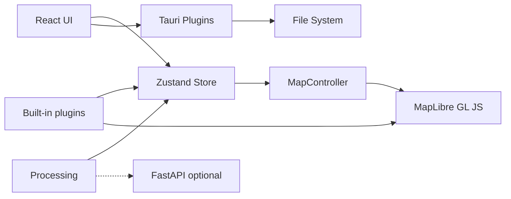

# GeoLibre Desktop Architecture

## Overview

GeoLibre Desktop is an npm workspaces monorepo. The UI is a React app hosted by Tauri v2. Map rendering uses MapLibre GL JS in the browser webview, with deck.gl used for advanced raster, point cloud, and 3D overlays. Application state lives in a Zustand store (`@geolibre/core`).



## Packages

| Package | Responsibility |
|---------|----------------|
| `@geolibre/core` | Domain types, project JSON schema, global store |
| `@geolibre/map` | MapLibre lifecycle, layer sync, GeoJSON, raster, tile, MBTiles, control, and selection styling |
| `@geolibre/ui` | Shared UI primitives (shadcn-style) |
| `@geolibre/processing` | Client-side algorithm registry |
| `@geolibre/plugins` | Plugin interface and built-in plugins |
| `geolibre-desktop` | Shell layout, Tauri I/O, composition |

## State flow

1. User adds data through the Add Data menu, the Tauri dialog, browser file picker, drag and drop, or a built-in plugin control.
2. Local vector data is parsed directly or converted to GeoJSON with DuckDB-WASM Spatial, then passed to `addGeoJsonLayer` in the store.
3. Tile, service, raster, ArcGIS, MBTiles, and plugin-backed layers create `GeoLibreLayer` records with source metadata and native MapLibre layer ids when applicable.
4. `MapCanvas` subscribes to `layers`, then `MapController.syncLayers` updates MapLibre sources and layers and keeps the layer control in sync.
5. Style panel and layer panel updates change layer state, then map sync updates paint, visibility, opacity, ordering, and removal.
6. Attribute table selections update the highlighted feature source and can zoom the map to the selected feature.
7. Desktop save uses `projectFromStore` and writes `.geolibre.json` to disk.

## DuckDB-WASM

Vector file import uses DuckDB-WASM for formats that need conversion before MapLibre can render them:

```sql
INSTALL spatial;
LOAD spatial;
```

GeoParquet is read with DuckDB's Parquet reader after loading Spatial. Other local vector formats are passed to Spatial `ST_Read` when the WebAssembly extension can load the GDAL-backed reader. Zipped Shapefiles are parsed with `shpjs` first, then DuckDB Spatial is tried if that parser cannot read the file. KMZ archives are unzipped in the browser and their KML files are passed through the same DuckDB Spatial KML reader.

## Advanced Add Data workflows

The v0.5.0 Add Data surface includes native dialogs for XYZ, WMS, vector files, GeoJSON URLs, vector tile sources, raster tile templates, COG and GeoTIFF rasters, MBTiles, and ArcGIS FeatureServer or VectorTileServer layers. The Components plugin wraps `maplibre-gl-components` panels for FlatGeobuf, PMTiles, Zarr, LiDAR, and Gaussian splats, then mirrors added layers into the GeoLibre store so the Layer panel, project format, and layer control can reason about them.

Local MBTiles tiles are read through a custom MapLibre protocol backed by Tauri commands. Remote rasters are fetched through the desktop backend when needed, and the local development server includes a raster proxy for selected release assets that need CORS handling.

## Python sidecar

The FastAPI app in `backend/geolibre_server` is reserved for heavier processing workflows and is planned to run as a Tauri **external binary**:

1. Bundle `geolibre-server` in `src-tauri/bin/`.
2. Spawn on first processing request needing GDAL/GeoPandas.
3. Communicate via HTTP on `127.0.0.1:8765`.

Not required for the MVP UI.

## Security

- Tauri CSP allowlists tile and style hosts (OpenFreeMap, CARTO).
- File access uses dialog-selected paths only.
