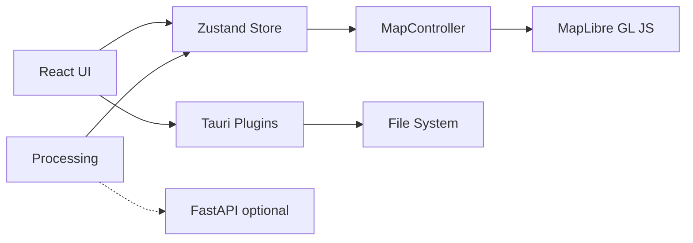

# GeoLibre Desktop Architecture

## Overview

GeoLibre Desktop is an npm workspaces monorepo. The UI is a React app hosted by Tauri v2. Map rendering uses MapLibre GL JS in the browser webview. Application state lives in a Zustand store (`@geolibre/core`).



## Packages

| Package | Responsibility |
|---------|----------------|
| `@geolibre/core` | Domain types, project JSON schema, global store |
| `@geolibre/map` | MapLibre lifecycle, layer sync, GeoJSON styling |
| `@geolibre/ui` | Shared UI primitives (shadcn-style) |
| `@geolibre/processing` | Client-side algorithm registry |
| `@geolibre/plugins` | Plugin interface and built-in plugins |
| `geolibre-desktop` | Shell layout, Tauri I/O, composition |

## State flow

1. User adds local vector data supported by DuckDB-WASM Spatial through the Tauri dialog, browser file picker, or drag and drop.
2. The selected vector data is parsed directly or converted to GeoJSON with DuckDB-WASM Spatial, then passed to `addGeoJsonLayer` in the store.
3. `MapCanvas` subscribes to `layers`, then `MapController.syncLayers` updates MapLibre sources and layers.
4. Style panel updates `layer.style`, then sync updates paint properties.
5. Desktop save uses `projectFromStore` and writes `.geolibre.json` to disk.

## DuckDB-WASM

Vector file import uses DuckDB-WASM for formats that need conversion before MapLibre can render them:

```sql
INSTALL spatial;
LOAD spatial;
```

GeoParquet is read with DuckDB's Parquet reader after loading Spatial. Other local vector formats are passed to Spatial `ST_Read` when the WebAssembly extension can load the GDAL-backed reader. Zipped Shapefiles are parsed with `shpjs` first, then DuckDB Spatial is tried if that parser cannot read the file.

## Python sidecar (v0.5)

The FastAPI app in `backend/geolibre_server` is planned to run as a Tauri **external binary**:

1. Bundle `geolibre-server` in `src-tauri/bin/`.
2. Spawn on first processing request needing GDAL/GeoPandas.
3. Communicate via HTTP on `127.0.0.1:8765`.

Not required for the MVP UI.

## Security

- Tauri CSP allowlists tile and style hosts (OpenFreeMap, CARTO).
- File access uses dialog-selected paths only.
