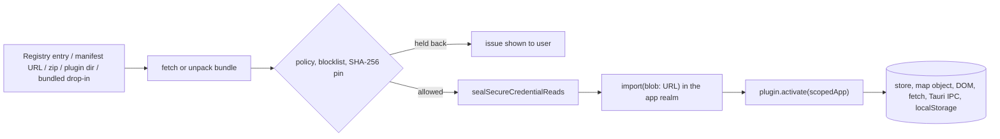
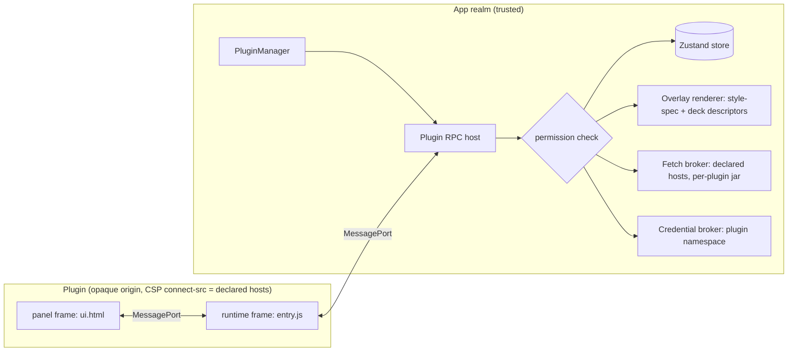

# Plugin isolation and permissions (design)

**Status:** proposal for review, nothing implemented. **Tracking:** the
"Plugin trust boundary" item of #2858. **Base:** `origin/main` at `126c51af`;
paths and line numbers below are as of that commit.

This page is a design document, not user documentation, so it is deliberately
left out of the MkDocs nav (like `cesium-parity-testing.md`).

## Summary

External plugins today are `import()`-ed from a `blob:` URL into the app's own
JavaScript realm. Everything since #1062 (trust prompts, SHA-256 pinning, the
registry hash and blocklist, the keychain read seal) decides *whether* code
runs; nothing limits *what* it can do once it runs. On desktop that is more than
"access to the app": a plugin can start the bundled JupyterLab server, receive
its token, and execute arbitrary code as the user (see
[Ambient authority](#ambient-authority-outside-the-api)). In the Jupyter embed,
the app is same-origin with the notebook server, which gives the same result.

The recommendation is three phases:

1. **Close the escalation paths and declare permissions.** Stop handing
   process-spawning tokens and raw secrets to JavaScript (Jupyter, sidecar, AWS,
   Earth Engine, AI keys), make Tauri's custom commands permissioned, add a
   `permissions` block to `plugin.json`, show it in the trust dialogs, and gate
   the `GeoLibreAppAPI` by it. The gating is advisory in this phase and the doc
   says so in the UI copy; the Rust-side changes are real.
2. **Sandboxed execution for plugins that opt in**: one opaque-origin iframe per
   plugin behind a `postMessage` RPC version of the app API, with map drawing
   through declarative layer descriptors and network egress enforced by the
   sandbox's CSP. This is the only option that works on all four targets
   (desktop, web, Jupyter, mobile).
3. **A trusted tier as the explicit escape hatch** for plugins that need the
   live map object (`getMap()`, custom WebGL layers, deck.gl overlays). Trusted
   plugins keep today's model, but the trust dialog says so plainly, the
   registry reviews them, and deployments can disable the tier.

Rough sizes: phase 1 M–L, phase 2 L, phase 3 M (mostly UX and policy, since
it is today's loader).

## Current state

### How an external plugin runs



- `loadExternalPlugins` (`apps/geolibre-desktop/src/lib/external-plugins.ts:146`)
  gathers bundles from the filesystem scan, manifest URLs and web-installed
  archives, applies the deployment policy (`enforcePluginPolicy`, line 65) and
  the blocklist (`assertBundleNotBlocklisted`, line 305), then calls
  `importExternalPlugin`.
- `importExternalPlugin` (line 587) seals keychain reads (line 589), wraps the
  entry source in a `Blob`, and `import()`s it (line 595). The module shares the
  window, the Zustand store, the map engines and `window.__TAURI_INTERNALS__`.
  Style sources are injected as a global `<style>` (line 649).
- `PluginManager` hands each lifecycle callback a shallow copy of the app API
  from `scopeAppToPlugin` (`packages/plugins/src/plugin-manager.ts:766`). The
  copy injects the owner id into menus, panels, assistant tools and
  `app.credentials` (line 827). It is the natural place for per-plugin gating,
  but today every member of the host API is passed through.

### What the existing mitigations do and don't stop

| Mitigation | Where | Stops | Does not stop |
| --- | --- | --- | --- |
| Project trust prompt | `plugin-trust.ts:46`, `ProjectPluginTrustDialog.tsx` | A shared `.geolibre.json` silently loading code (#1062) | Anything a trusted plugin does after the user clicks "Trust and load" |
| SHA-256 pin (TOFU) | `plugin-integrity.ts:154` | A manifest URL silently serving new code after first use | A malicious first version; bundled drop-ins and zips are not pinned |
| Registry `bundleSha256` | `plugin-registry.ts:311` (#2857) | A compromised plugin host serving code other than what the registry reviewed | A malicious plugin that passed review; manifest-URL and zip installs |
| Registry blocklist | `plugin-blocklist.ts` (#2873) | Loading a plugin or exact bundle after maintainers pull it | Damage done before it was listed, or while offline with no cached list |
| Keychain read seal | `credential-store.ts:55`, `secure_store.rs` (#2861) | A plugin calling `secure_store_get_many` to dump the OS credential store | Secrets already hydrated into JS memory (all of them, by design, `credential-hydration.ts:81`); `secure_store_set`/`_delete` (`secure_store.rs:158,166`), which are not gated; web/Jupyter/mobile, where values sit in `localStorage` |
| Desktop CSP | `tauri.conf.json:24` (#2875) | Loading scripts from unlisted hosts | Exfiltration: `connect-src` allows `https:` and `http:`; plugin code arrives as `blob:`, which `script-src` must allow; `'unsafe-eval'` is on |
| Deployment policy | `deployment-policy.ts:36` (`allowed`, `blocked`, `sideload`) | Unapproved plugins in managed deployments | What an approved plugin does |

The docs already state the conclusion: "This is storage, not isolation"
(`docs/plugin-api.md:1243`) and the trust dialog says plugins "run with the same
privileges as GeoLibre itself" (`en.json`, `managePlugins.trust.warning`).

### The plugin API surface, classified

`GeoLibreAppAPI` (`packages/plugins/src/types.ts:480`) has about 100 members,
built by `createAppAPI` (`apps/geolibre-desktop/src/lib/app-api.ts:204`). The
table groups them by what a malicious caller gains. "Crosses RPC" says whether
the member can be offered to a sandboxed plugin as-is (data in and out is
structured-cloneable) or needs a redesign.

| Group | Members | Risk | Crosses RPC |
| --- | --- | --- | --- |
| Read project data | `listLayers`, `getLayers`, `getLayerFeatures`, `getSelectedFeatures`, `getSelectedLayerId`, `getDrawnFeatures`, `onSelectionChange`, `onLayersChanged`, `readRasterWindow`, `queryZarrLayer`, `queryOvertureFeatures`, `getProjectSnapshot`, `listLayerGroups`, `getActiveBasemap`, `getBasemapLayerIds`, `getViewBounds`, `getMapRenderer`, `getMapProjection`, `isTerrainEnabled`, `getLocale` | Medium: user data can be exfiltrated. `getProjectSnapshot` returns the egress snapshot (`app-api.ts:502`, `redactCredentials` in `build-project-snapshot.ts:75`), so credentials are redacted, but features and layer data are not | Yes (async) |
| Mutate project | `addGeoJsonLayer`, `addTileLayer`, `addWmtsLayer`, `addWmsLayer`, `addWfsLayer`, `addCogLayer`, `addZarrLayer`, `setZarrLayerSelector`, `importLayerStyle`, layer-group members, `setBasemap`, `fitBounds`, `setMapProjection`, `setTerrainEnabled`, `registerTemporalLayer` | Low–medium: vandalism, or adding a tile layer whose URL logs the viewport | Yes, except `registerTemporalLayer` (adapter object with methods; needs a callback proxy) |
| Credentials | `credentials` (scoped), `getMapboxAccessToken` (`app-api.ts:492`) | High. `getMapboxAccessToken` returns the user's own Mapbox token to any plugin | `credentials` yes; the token getter should not exist for sandboxed plugins |
| Network | `fetchArrayBuffer` (`app-api.ts:421`, native fetch on desktop), `fetchVectorUrl`, `nativeFetch` (`app-api.ts:422`, `plugin_http.rs`, #2848) | Medium–high: CORS bypass from the user's network position (LAN and loopback are allowed by design; see the test at `lib.rs:5474`); `nativeFetch` shares one cookie jar across all plugins (`plugin_http.rs:125-138`), so one plugin can ride another's session | Yes, and network policy can be enforced host-side |
| Files | `pickLocalDirectoryFiles`, `pickVectorFilesWithSidecars`, `importTextFile`, `exportTextFile` (user-mediated); `readLocalVectorFile` (`app-api.ts:597`, by path, no dialog) | Pickers low; `readLocalVectorFile` high: `read_local_file` (`lib.rs:858`) reads any absolute path with a vector extension, which includes `.json` and `.csv` (for example `~/.config/gcloud/application_default_credentials.json`) | Pickers yes (`File` is cloneable); path reads should be trusted-tier only |
| Other plugins | `activatePlugin`, `deactivatePlugin` | Low–medium | Yes, with an allowlist |
| AI assistant | `registerAssistantTool`, `registerAssistantToolSpec`, `registerAssistantGuidance` | Medium: prompt injection into the assistant, which itself holds provider keys and can call every tool | `ToolSpec` yes (callback becomes an RPC call); `Tool` objects no |
| UI injection | `registerRightPanel`, `registerFloatingPanel`, `registerToolbarMenu`, `registerMenuContribution` (#2852, #2853), their open/close members, `registerTranslations`, `translate`, `onLocaleChange` | Medium: the `render(container)` contract hands the plugin a live element in the app's DOM, from which the whole document (and every input, including token fields in Settings) is reachable | Menus yes (labels + `onSelect` event); panels need a frame-per-surface redesign |
| Map controls | `addMapControl`, `removeMapControl`, built-in control members | High in practice: `IControl.onAdd(map)` receives the live map, the same escape as `getMap()` | No; needs a host-rendered control descriptor |
| Live map objects | `getMap` (`app-api.ts:452`), `getMapboxMap`, `getMapboxGl`, `getCesiumScene`, `getArcgisView`, `getArcgisControlMap`, `registerExternalNativeLayer` | High: the live renderer exposes `getStyle()` (tile URLs with embedded keys), request hooks, the canvas, and every layer of every plugin | No; this is what the trusted tier is for |
| Host libraries | `getDeckGL`, `getMaplibreGlRaster`, `getProj4`, `setCogRenderEngine` | Low on their own; they are classes and functions | No (plugins in a sandbox bundle their own, or use descriptors) |

### Ambient authority outside the API

Gating the API changes nothing while plugin code shares the realm, because the
realm itself grants more than the API does:

- **Tauri IPC, unpermissioned.** `generate_handler!` registers 42 custom
  commands (`lib.rs:481-525`). `build.rs` calls plain `tauri_build::build()`
  with no app manifest, so Tauri v2 allows every custom command from every
  webview; `capabilities/default.json` only governs plugin commands (`fs:*`,
  `http:default`, `opener`, `dialog`, …). Any code in the window can call
  `window.__TAURI_INTERNALS__.invoke(...)`; three registry bundles already touch
  `__TAURI_INTERNALS__` (two for runtime detection, one to call the opener).
- **Local code execution.** `start_jupyter_server` (`lib.rs:2794`) returns
  `{url, port, token}` (`JupyterServerInfo`, `lib.rs:2418`), and the CSP allows
  `http:` and `ws://127.0.0.1:*`. A plugin can start JupyterLab and run Python
  through its kernel API. This makes the keychain seal a speed bump on desktop:
  a process running as the user can usually read an unlocked Secret Service
  collection directly. (Not in the Mac App Store build, which compiles the
  Jupyter server out.)
- **Arbitrary file access via the sidecar.** `start_geolibre_sidecar` returns the
  per-launch bearer token (`SidecarServerInfo`, `lib.rs:2408`); on desktop
  `GEOLIBRE_CONVERSION_ROOTS` is unset, which means "no restriction"
  (`backend/geolibre_server/geolibre_server/app/conversion.py:154-164`), so the
  conversion and Whitebox endpoints read and write any path.
- **Secrets returned on demand.** `aws_resolve_credentials`
  (`aws_credentials.rs:945`) returns access keys; `poll_earth_engine_oauth`
  (`earth_engine_oauth.rs:107`) returns the OAuth token; `read_env_vars`
  (`lib.rs:1282`) returns the assistant's provider API keys from the allowlist at
  `lib.rs:1254`.
- **Persistence.** `install_external_plugin_archive` (`lib.rs:1853`) lets a
  plugin install another plugin from any zip path; `fs:allow-write-file` plus
  the persisted dialog scope (`lib.rs:447`) let it write into any folder the user
  ever picked.
- **Secrets in memory.** Startup hydration loads every saved credential into
  module state (`credential-hydration.ts:81-94`): Settings tokens
  (`desktop-settings-secrets.ts:13`), AI profile keys, S3 secrets, PostGIS
  passwords, project credentials and every plugin's `app.credentials`. A plugin
  that wraps `fetch`, `XMLHttpRequest` or `invoke` sees them as they are sent,
  and the live map's style carries tile URLs with keys in their query strings.
- **The DOM.** A plugin can read Settings input fields, overlay a fake dialog,
  or add a `<style>` that hides the trust prompt.
- **Jupyter embed origin.** The widget loads the app from
  `{base_url}geolibre/app/` on the Jupyter server's own origin
  (`python/src/geolibre/_extension.py`, `_frontend.js:220-255`) in an iframe with
  no `sandbox` attribute. Code in it is same-origin with JupyterLab, so it can
  reach `window.parent` and the Jupyter REST API with the user's session: start a
  kernel, execute code. This is the largest exposure outside desktop.
- **Web.** The nginx CSP (`docker/nginx.conf:133,188`) allows `connect-src
  https:`; `localStorage` holds every credential.

### Plugin inventory

Built-in plugins (181 modules under `packages/plugins/src/plugins/`, registered in
`apps/geolibre-desktop/src/hooks/usePlugins.ts`) are first-party code reviewed in
this repo and stay trusted; nothing here changes them. Bundled drop-ins under
`apps/geolibre-desktop/public/plugins/` are git-ignored deployer payloads (none
are committed) and are as trusted as the deployment (`external-plugins.ts:152`).

The registry (`opengeos/geolibre-plugins/registry/`) lists 16 plugins; 13 have
third-party authors. A scan of their published bundles for app API members and
realm globals:

| Need | Plugins | Count |
| --- | --- | --- |
| Live map via `getMap()` | aorctodss, contour, d2s, flood-gauges, hypercoast, inaturalist-extractor, nasa-opera, netcdf, movecost, open-climate-service, openrndt, streamsnap | 12 |
| Live map via `addMapControl` only | copernicus-ems, flowmaps, sample-plugin | 3 |
| Neither | geoenergy-catalog | 1 |
| DOM panels (`registerRightPanel` / floating) | all except hypercoast, whose UI lives in a map control | 15 |
| `registerExternalNativeLayer` | 11 | 11 |
| deck.gl (`getDeckGL` or own) | hypercoast, flowmaps | 2 |
| `nativeFetch` | d2s | 1 |
| `credentials` | contour, nasa-opera, flowmaps | 3 |
| Own `localStorage` / IndexedDB | movecost, openrndt / hypercoast, netcdf | 4 |
| `__TAURI_INTERNALS__` | copernicus-ems, nasa-opera, openrndt | 3 |

So 15 of 16 reach the live map today. A sandbox without a map-drawing story
would serve one plugin. Most map use is `addSource`/`addLayer`, click and
hover handlers, and `fitBounds` (expressible as descriptors); the heavier cases
(nasa-opera with 22 `addLayer` sites, hypercoast and flowmaps with deck.gl,
open-climate-service with Zarr, contour with workers and WebGL) need either a
richer descriptor vocabulary or the trusted tier.

## Threat model

**Attackers in scope**

1. A malicious plugin author who publishes to the registry, or ships a zip or
   manifest URL that a user installs. The code may behave well under review and
   act later (time bomb, remote-config switch).
2. A compromised plugin host or author account that serves new code under a
   pinned URL, or publishes a malicious new version to the registry.
3. A shared project file that asks to load a plugin (already gated by the trust
   prompt; in scope because the user may accept it).
4. A benign plugin with an exploitable bug (XSS through untrusted feature
   properties rendered into its panel) that an attacker triggers with a crafted
   dataset.

**Assets**, roughly in order of severity:

1. The user's machine: code execution through Jupyter, the sidecar, plugin
   installation, or file writes (desktop); code execution on the Jupyter host
   (Jupyter embed).
2. Credentials: OS keychain entries, Settings tokens, AI keys, AWS and Earth
   Engine credentials, S3 secrets, PostGIS passwords, other plugins' secrets.
3. Network identity: the native cookie jar, mTLS client identity used by the
   native HTTP client (`lib.rs:1572`), LAN reachability, the share session.
4. User files: local vector files by path, picked folders, project files.
5. Project data: layers, features, attribute values, selections.
6. Integrity of the UI: trust dialogs, Settings, what the user sees and clicks.

**Out of scope**

- Built-in plugins and bundled drop-ins (same trust as the app build).
- A compromised GeoLibre build, update channel, or registry signing process.
- Side channels (timing, GPU) and denial of service beyond "the plugin can be
  disabled". A sandboxed plugin can still burn CPU in its own frame.
- Phishing via legitimate UI: a plugin may display misleading content inside
  its own panel. The host must keep its own chrome (dialogs, Settings) out of
  plugin reach, not police plugin content.
- Malicious data without a plugin (covered by the existing input hardening).

**Goal statement.** For a plugin installed at a given permission level, the
damage it can do is bounded by what that level declares, and the user saw that
declaration before the code ran. For trusted-tier plugins the bound is
"everything the app can do", and the user is told that.

## Options

### a. Declared permissions + API gating, no sandbox

Add a `permissions` block to `plugin.json`, show it in the trust and
marketplace dialogs, and have `scopeAppToPlugin` omit members the plugin did
not declare (it already deletes the assistant members outside activation,
`plugin-manager.ts:802-807`).

- **Security:** advisory. Code that shares the realm reaches everything in
  [Ambient authority](#ambient-authority-outside-the-api) without asking. Its
  value is elsewhere: a review surface for the registry, honest disclosure in
  the trust dialog, catching accidental overreach in well-behaved plugins, and
  the contract phase 2 will enforce.
- **Compatibility:** additive. A plugin without a block is treated as
  "undeclared" and gets today's behaviour plus a warning.
- **Performance:** none.
- **Cost:** S–M.
- **Targets:** identical everywhere.

### b. Sandboxed iframe (or Worker) per plugin behind an RPC app API

Each sandboxed plugin runs in `<iframe sandbox="allow-scripts">` loaded from
`srcdoc` or a `blob:` document. Without `allow-same-origin` the frame gets an
opaque origin: no access to the parent DOM, `localStorage`, IndexedDB, cookies,
or (to be verified per webview) Tauri IPC. The frame receives one
`MessagePort`; the host implements the app API on the other end. A Worker gives
the same isolation without DOM, but 15 of 16 registry plugins render panels, so
iframes are the default and a Worker is an option for headless plugins.

Network egress becomes enforceable. A `srcdoc` or `blob:` frame inherits the
parent's CSP, and a `<meta http-equiv="Content-Security-Policy">` in the frame
document can only narrow it, so the host writes `connect-src` from the
plugin's declared hosts (`'none'` when it declared none). Requests leave with
`Origin: null` and no app cookies. That is the first real enforcement point
GeoLibre would have.

**Map access** is the hard part. Proposed approach, in order of preference:

1. *Store-level calls* that already exist and cross RPC: `addGeoJsonLayer`,
   `addTileLayer`, `addCogLayer`, `addZarrLayer`, `fitBounds`. These render on
   every engine, which is better than today's `getMap()` (MapLibre-only).
2. *Declarative descriptors* for plugin-owned overlays: a MapLibre style-spec
   source plus layers, validated with the style-spec validator, namespaced by
   the host (the same `layer.id`-prefixing rule the ArcGIS renderer uses), with
   data passed as GeoJSON or as transferable `ArrayBuffer`s (FlatGeobuf,
   GeoArrow). Updates are `setData`/`setPaintProperty` messages. deck.gl layers
   use the `@deck.gl/json` converter vocabulary (layer class names from an
   allowlist, accessors as field names or expressions, binary attributes as
   transferables), drawn by the host's own deck overlay.
3. *Event subscriptions* instead of `map.on`: `click`, `mousemove`, `moveend`
   with serializable payloads (lngLat, point, features from
   `queryRenderedFeatures` limited to the plugin's own layers).
4. *Host-rendered controls* instead of `IControl`: a button descriptor (icon,
   title, toggled state) whose clicks arrive as events.
5. *Remote rendering* (the plugin draws into an `OffscreenCanvas` and the host
   composites it as a canvas or image source): technically possible, adds a
   frame of latency and needs camera sync messages every frame. Not proposed
   for phase 2; noted as a possible later descriptor kind.

**UI surfaces.** A panel, floating panel or map-control popover becomes a
sandboxed frame the host mounts in the surface's container. Opaque origins are
unique per frame, so two surfaces of one plugin cannot share memory; the model
is one *runtime* frame per plugin (the plugin's `entry`) plus one frame per
visible surface loaded from a declared `ui` HTML entry, each connected to the
runtime by a `MessagePort` the host brokers. This is the model Figma (sandboxed
main code plus a UI iframe) and VS Code webviews use. A simpler "panel-only"
mode, where the panel frame *is* the runtime, covers plugins with a single
surface. Theme tokens and locale are pushed to frames as messages; the host
injects a base stylesheet so plugin UIs keep the app's look (the HSL variable
convention from the plugin docs).

- **Security:** real isolation for the frame's code on web, Jupyter, mobile and
  desktop, conditional on the webview not exposing IPC to sandboxed frames (a
  phase-2 gate test, below). Residual risks: data the user lets the plugin read
  can leave through its declared hosts; descriptor validation must reject
  style-spec features that fetch (`glyphs`, `sprite`, source URLs) unless the
  host is declared; the host must never render plugin-supplied HTML into its own
  DOM (menu labels are text only).
- **Compatibility:** a new API flavour. All members become async; callbacks
  become subscriptions; objects with methods (`Tool`, `TemporalLayerAdapter`,
  `IControl`) become descriptors plus events. Existing plugins need a port.
  The `@geolibre/embed` package and `lib/embed-api.ts` already define a
  versioned `postMessage` envelope with origin checks; the plugin RPC should
  reuse that envelope style rather than invent another.
- **Performance:** map rendering is unaffected (the host draws). Costs are in
  update traffic: structured-cloning a 50 MB FeatureCollection costs hundreds of
  milliseconds, so large data must cross as transferable buffers, which the
  GeoArrow path (#2897) already produces. Per-frame animation through
  descriptors is not a goal. Each frame is a full document (single-digit to
  tens of MB); a dozen plugins is fine, a hundred is not.
- **Cost:** L. The RPC layer is mechanical; descriptors, events, host-rendered
  controls and the surface broker are the real work, plus a plugin SDK package
  that makes the async API pleasant.
- **Targets:** works in WebKitGTK, WKWebView, WebView2, Chromium and Android
  WebView. In the Jupyter embed it is the only way to keep plugin code away from
  the notebook server's origin.

### c. Tauri isolation pattern or a separate webview

- **Isolation pattern** (`"pattern": {"use": "isolation"}`) routes every IPC
  message through a sandboxed isolation frame that can inspect or reject it.
  It cannot tell *which* code in the main realm sent a message, so it cannot
  allow `start_jupyter_server` for the Notebook panel and refuse it for a
  plugin. It adds encryption overhead to every IPC call and does nothing for the
  DOM or memory. Not useful for this problem.
- **A separate webview or window per plugin** with its own label and a
  capability granting nothing (or a minimal set). Capabilities bind to webview
  labels, so this is a real IPC boundary as well as a separate JavaScript
  realm. But it cannot share the map's WebGL context, so drawing
  still needs descriptors (option b's work), and child webviews over the map
  need the `unstable` multiwebview feature (not enabled in `Cargo.toml:37`),
  transparent compositing, and input routing, with no mobile support.
  Strictly more cost than b for a desktop-only gain. One narrow use is worth
  keeping: loading the **JupyterLab panel** in its own webview whose URL Rust
  sets, so its token never reaches the main window's JavaScript.
- **Prerequisite either way:** make custom commands permissioned with
  `tauri_build::Attributes::app_manifest(AppManifest::new().commands(...))` in
  `build.rs`, and grant them to the `main` window explicitly. That is what lets
  any non-`main` webview (or an IPC request from an unexpected frame) be refused.

### d. Move secret use to Rust

Even a fully privileged plugin cannot read a secret that never enters
JavaScript. Two kinds of secret need different treatment:

- **Rust-injectable**: used only in HTTP requests the app makes. AI provider
  keys (today returned by `read_env_vars` and hydrated into profiles), AWS keys
  (sign or presign in Rust and hand JavaScript a time-limited presigned URL),
  the Earth Engine refresh token (keep it in Rust and hand out the short-lived
  access token the EE client needs), PostGIS passwords (pass an account id to
  the sidecar), the share token, `plugin.*` credentials of sandboxed plugins
  (their RPC `fetch` goes through the host anyway). A native request carries a
  credential *reference*, and Rust resolves and injects it.
- **Renderer-bound**: SDKs that take the token in JavaScript (mapbox-gl,
  CesiumJS Ion, the ArcGIS JS SDK, MapLibre tile URLs with `?key=`). These
  cannot move without proxying every tile through a custom protocol, which
  costs per-tile IPC latency. Mitigate with narrow tokens (URL-restricted
  Mapbox `pk.` tokens, referrer-restricted ArcGIS keys and Ion tokens) and by
  not exposing them through the API (`getMapboxAccessToken`).

Injection must bind each secret to hosts when it is saved ("this key is only
ever sent to `api.anthropic.com`"); otherwise a plugin asks Rust to inject the
key into a request to its own echo server, a classic confused deputy. Rust also
needs to know *who* is asking before injecting a plugin credential, which it
cannot in a shared realm; for sandboxed plugins the host's RPC layer is the
caller and attaches the plugin id.

- **Security:** strong for the injectable set, on desktop and (once a store
  exists) mobile. Nothing for web and Jupyter, where there is no Rust.
- **Compatibility:** internal to the app except `getMapboxAccessToken` and the
  AWS/EE flows. **Performance:** an IPC hop on requests that already go native.
- **Cost:** M, spread across features that each own a flow.

### e. ShadowRealm or SES compartments (Hardened JS)

- **ShadowRealm** is not shipped in the engines GeoLibre targets at the time of
  writing (WebKitGTK, WKWebView, WebView2, Android WebView); verify before
  relying on that. Its callable boundary passes only primitives and functions,
  and a realm has no DOM, so it would need the same RPC and descriptor design as
  b without the network enforcement that a frame's CSP provides.
- **SES `lockdown()`** freezes the intrinsics of the realm it runs in. Applying
  it to the app realm would break the app and its dependencies, which patch
  prototypes (GeoLibre itself patches MapLibre internals; several upstream
  packages are patched with `patch-package`). Compartments without lockdown are
  not a security boundary. Running SES *inside* a sandbox frame adds little over
  the frame itself. Figma's move from a Realms-shim sandbox to a QuickJS
  interpreter compiled to WebAssembly after a 2019 escape is a useful cautionary precedent for in-realm isolation.
- **Verdict:** not viable today; revisit only if ShadowRealm ships everywhere,
  and even then it is a different transport for option b, not a replacement.

### Options compared

| | a. Permissions | b. Sandbox frame | c. Separate webview | d. Secrets to Rust | e. SES / ShadowRealm |
| --- | --- | --- | --- | --- | --- |
| Enforced boundary | No | Yes | Yes (desktop) | For injectable secrets | No / not available |
| Plugin API change | Additive | New async API | New async API | Small | New API |
| Map drawing | Unchanged | Descriptors | Descriptors | Unchanged | Descriptors |
| Desktop / web / Jupyter / mobile | ✓ / ✓ / ✓ / ✓ | ✓ / ✓ / ✓ / ✓ | ✓ / ✗ / ✗ / ✗ | ✓ / ✗ / ✗ / partial | ✗ |
| Cost | S–M | L | L+ | M | n/a |

## Recommendation

### Phase 1: close escalation paths, declare permissions (M–L)

Real enforcement in Rust, advisory gating in JavaScript.

**1a. Make custom Tauri commands permissioned.** Add an app manifest in
`build.rs` listing all 42 commands and a `main`-only capability granting them.
This changes nothing for the app today but makes every later restriction
(a plugin webview, the Jupyter webview) default-deny.

**1b. Take process and secret handles away from JavaScript.**

| Today | Change |
| --- | --- |
| `start_jupyter_server` returns the token | Load JupyterLab in a Rust-created webview (or window) whose URL includes the token; JavaScript gets only "running/stopped". Open question if the relay (`useJupyterRelay`) needs the token. |
| `start_geolibre_sidecar` returns the bearer token | Route sidecar calls through a Rust command that attaches the token (the native HTTP path already exists for `127.0.0.1:8765`), and set desktop conversion roots to the user's picked scope rather than "unrestricted". |
| `aws_resolve_credentials` returns keys | Presign in Rust; return presigned URLs. |
| `poll_earth_engine_oauth` returns the token | Keep the refresh token in Rust; return a short-lived access token. |
| `read_env_vars` returns AI keys | Inject them in a native request to the provider's host. |
| `secure_store_set` / `_delete` accept any account | Refuse writes to non-`plugin.*` accounts unless the call comes from host code paths (an opaque per-session capability token that Rust hands only to the startup bundle, alongside the startup read). |
| `install_external_plugin_archive` takes any path | Require a path the user just picked through the dialog (`fs_scope().is_allowed`, as `allow_raster_asset` does at `lib.rs:1103`). |
| `read_local_file` reads any `.json`/`.csv` | Require the path to be in the fs scope or listed as a layer `sourcePath` in the open project. |
| `nativeFetch` shares one cookie jar | One jar per plugin id (the host passes the id; advisory until phase 2, real after). |

**1c. Permissions manifest.** Add the block below to
`GeoLibreExternalPluginManifest` (`types.ts:1414`), the registry schema
(`schemas/plugin-manifest.schema.json`), `isExternalPluginManifest`, and the
Rust zip validator.

```typescript
/** Declared in plugin.json. Omitted = "undeclared" (legacy, treated as trusted). */
export interface GeoLibrePluginPermissions {
  /** "sandboxed" (phase 2) or "trusted" (today's model). */
  runtime: "sandboxed" | "trusted";
  project?: {
    /** Read layers, features, selection, drawn features, project snapshot. */
    read?: boolean;
    /** Add, restyle, group and remove layers; basemap; camera. */
    write?: boolean;
  };
  /** Draw on the map through descriptors (sandboxed) or the store. */
  mapOverlay?: boolean;
  /** Live renderer objects: getMap, getCesiumScene, IControl. Trusted only. */
  mapDirect?: boolean;
  network?: {
    /** Origins the plugin's own code and descriptors may contact. "*" allowed but flagged. */
    hosts: string[];
    /** Desktop native fetch with a per-plugin cookie jar, to `hosts` only. */
    native?: boolean;
  };
  files?: {
    /** User-mediated pickers and save dialogs. */
    pick?: boolean;
    /** Read local files by path without a dialog. Trusted only. */
    byPath?: boolean;
  };
  /** app.credentials in the plugin's own namespace. */
  credentials?: boolean;
  /** Register tools and guidance with the AI assistant. */
  assistant?: boolean;
  ui?: Array<"rightPanel" | "floatingPanel" | "toolbarMenu" | "menuContribution" | "mapControl">;
  /** Plugin ids this plugin may activate or deactivate. */
  plugins?: string[];
}
```

`scopeAppToPlugin` builds the scoped app from this declaration: members outside
it are absent (not throwing stubs, so feature detection with optional chaining
keeps working). Members that only trusted plugins may have (`getMap`,
`addMapControl`, `readLocalVectorFile`, `getMapboxAccessToken`, `nativeFetch`
without hosts) are omitted unless `runtime: "trusted"`. In this phase the
registry CI checks that a bundle's use of members matches its declaration (the
same scan this document used), which is where the advisory gating earns its
keep.

**1d. Trust dialog and marketplace UX.** The registry install dialog, the
project trust dialog and the marketplace detail view list the permissions in
plain language, grouped by severity, with "trusted" shown as a single,
unmissable line ("Full access: this plugin can do anything GeoLibre can,
including reading your saved credentials and files"). An undeclared plugin
shows the same full-access line. Upgrades that add permissions re-prompt, the
same way a changed hash is held back today (`HeldBackPluginBundle`). Settings →
Plugins shows each plugin's permissions and tier.

**1e. Deployment policy.** `plugins.allowTrusted: false` refuses trusted and
undeclared external plugins; `plugins.maxPermissions` caps declarations. The
Jupyter embed defaults to `allowTrusted: false` once phase 2 ships, given its
same-origin exposure. (Should it default to that *now*, which disables external
plugins there? Open question.)

### Phase 2: sandboxed runtime (L)

Ship option b for plugins that declare `runtime: "sandboxed"`.



RPC surface, as the SDK presents it to plugin code:

```typescript
/** What a sandboxed plugin receives in activate(). Every call is async. */
export interface GeoLibreSandboxAPI {
  readonly apiVersion: 1;
  readonly permissions: GeoLibrePluginPermissions;
  project: {
    listLayers(): Promise<GeoLibreLayerSummary[]>;
    getLayerFeatures(layerId: string, opts?: { limit?: number; format?: "geojson" | "geoarrow" }): Promise<FeatureCollection | ArrayBuffer>;
    getSelection(): Promise<GeoLibreSelection>;
    on(event: "selection" | "layers" | "basemap" | "locale", cb: (payload: unknown) => void): Unsubscribe;
    addGeoJsonLayer(name: string, data: FeatureCollection | ArrayBuffer): Promise<string>;
    addTileLayer(name: string, url: string, options?: GeoLibreTileLayerOptions): Promise<string>;
    // ... the other store-level members from the "Mutate project" row
  };
  map: {
    getView(): Promise<{ center: [number, number]; zoom: number; bounds: [number, number, number, number]; renderer: MapRendererKind }>;
    fitBounds(bounds: [number, number, number, number]): Promise<void>;
    /** Plugin-owned overlay; ids are namespaced by the host. */
    setOverlay(overlay: PluginOverlayDescriptor): Promise<void>;
    updateOverlayData(id: string, data: FeatureCollection | ArrayBuffer): Promise<void>;
    removeOverlay(id: string): Promise<void>;
    on(event: "click" | "mousemove" | "moveend", opts: { overlays?: string[] }, cb: (e: PluginMapEvent) => void): Unsubscribe;
    addControlButton(button: { id: string; icon: string; title: string; pressed?: boolean }, onClick: () => void): Promise<Unsubscribe>;
  };
  ui: {
    registerPanel(panel: { id: string; title: string; kind: "right" | "floating"; ui: string /* path in bundle */ }): Promise<Unsubscribe>;
    registerToolbarMenu(menu: GeoLibreToolbarMenu /* onSelect becomes an event */): Promise<Unsubscribe>;
    notify(message: string, level?: "info" | "warning" | "error"): void;
  };
  net: { fetch(input: string, init?: RequestInit): Promise<Response> };
  credentials: { get(name: string): Promise<string>; set(name: string, value: string): Promise<boolean> };
  assistant: { registerTool(spec: AssistantToolSpec): Promise<Unsubscribe> };
  files: { pick(opts?: GeoLibreFileDialogOptions): Promise<File[] | null>; save(name: string, data: string | Blob): Promise<void> };
}

export type PluginOverlayDescriptor =
  | { id: string; kind: "style"; source: SourceSpecification; layers: LayerSpecification[]; beforeId?: string }
  | { id: string; kind: "deck"; layers: Array<{ "@@type": DeckLayerAllowlist; [prop: string]: unknown }> };
```

Host responsibilities: validate every descriptor (style-spec validation; strip
or check `glyphs`, `sprite`, tile and data URLs against declared hosts),
namespace ids, clean up on deactivate, rate-limit and size-cap messages, and
time out calls. The sandbox gets a base stylesheet with the theme tokens.

Gate tests before this phase can be called a boundary, per webview (WebKitGTK,
WKWebView, WebView2, Chromium, Android WebView): a probe plugin in the sandbox
must fail to reach `window.parent.document`, `window.__TAURI_INTERNALS__`,
`ipc://localhost` and `http://ipc.localhost` (both in the desktop
`connect-src`), `localStorage`, an undeclared host, and the Jupyter REST API in
the embed.

### Phase 3: trusted tier as an explicit escape hatch (M)

`runtime: "trusted"` keeps today's loader and full API. It differs from today
only in being declared, disclosed, reviewable and switchable:

- The registry labels trusted plugins and requires a justification field.
- The trust dialog says "full access" in the first line (1d).
- Deployments can disable the tier (1e); the Jupyter embed does by default.
- Phase-1 Rust changes still apply, so a trusted plugin no longer gets a
  Jupyter token or raw AWS keys for free; it gets the same app-level access
  the app's own UI has.
- Over time, descriptor kinds grow (raster, Zarr, temporal adapters as
  declarative bindings) so plugins can move down a tier. A "hybrid" plugin
  (sandboxed runtime, one trusted shim for a custom WebGL layer) is a possible
  later step, but it reintroduces realm access and is not proposed.

### Migration plan

1. Phase 1 ships with "undeclared = trusted + warning", so all 16 registry
   plugins keep working. Registry CI starts requiring a `permissions` block for
   new versions after a grace period; the opengeos-owned plugins (d2s,
   hypercoast, nasa-opera, sample) adopt it first and serve as examples.
2. The plugin template (`opengeos/geolibre-plugin-template`) gains the block
   and, in phase 2, a sandboxed variant built on a small SDK package that wraps
   the RPC.
3. Phase 2 candidates from the inventory: geoenergy-catalog (no map object),
   then plugins whose map use is sources, layers, clicks and `fitBounds`
   (likely inaturalist-extractor, streamsnap, flood-gauges, copernicus-ems,
   d2s, openrndt, sample). Heavy renderers (nasa-opera, hypercoast, flowmaps,
   netcdf, open-climate-service, contour, aorctodss, movecost) stay trusted
   until the descriptor vocabulary covers them. This split is from a static
   scan; each needs a short audit with its author.
4. Built-ins stay as they are. Converting one or two built-ins to the sandboxed
   API is the best dogfood for the SDK (good candidates: a pure data-catalog
   plugin), but it is optional.

## Effort and tests

| Phase | Size | Main work | Tests |
| --- | --- | --- | --- |
| 1a app manifest | S | `build.rs`, capability file | Rust test that every `generate_handler!` command is in the manifest; desktop e2e smoke still green |
| 1b handles to Rust | M | Six flows (Jupyter, sidecar, AWS, EE, AI keys, store writes) plus path checks | Per-command Rust unit tests; a probe plugin (as used for #2861) asserting each command no longer returns a secret or token, run in the packaged desktop app; Jupyter panel and sidecar e2e unchanged |
| 1c manifest + gating | S–M | Types, schema, validators (TS and Rust), `scopeAppToPlugin` | Contract tests in `tests/` for member presence per declaration; manifest validation tests; registry CI scan |
| 1d/1e UX + policy | S–M | Dialog copy (i18n in every locale), Settings view, policy keys | Component tests; a11y sweep; Playwright install flow showing permissions and re-prompting on an added permission |
| 2 sandbox | L | RPC host, SDK, descriptors (style + deck), events, controls, surface broker, fetch and credential brokers | Gate tests above on every webview (Playwright for Chromium/WebKit, the WebKitGTK harness, desktop e2e, Android emulator); RPC contract tests; descriptor validation fuzzing; perf benchmark (100k-feature overlay via GeoArrow, update latency); a port of the sample plugin and geoenergy-catalog as e2e fixtures |
| 3 trusted tier | M | Registry fields and review policy, dialog states, Jupyter default | Policy tests; e2e that a trusted plugin is refused when the tier is disabled |

## Open questions for the maintainer

1. **Is the phase-1 Jupyter token change acceptable?** Moving JupyterLab into a
   Rust-created webview fixes the worst desktop path but touches the Notebook
   panel and the relay (`useJupyterRelay`). The cheaper alternative is a native
   confirmation dialog before starting the server, which only adds friction.
2. **Jupyter embed now:** should external plugins be disabled by default in the
   embed until phase 2, given the same-origin exposure? Or should the embed
   iframe itself be sandboxed (this breaks `localStorage`-backed features
   there)?
3. **Undeclared plugins:** keep loading them as trusted with a warning
   indefinitely, or set a date after which the registry refuses them?
4. **Descriptor scope for phase 2:** style-spec plus deck JSON only, or also
   raster/COG and Zarr overlays (needed by hypercoast, netcdf,
   open-climate-service)?
5. **Network permission granularity:** origins only, or path prefixes? Should
   `"*"` be allowed for "connect to any WMS the user enters" plugins, and how is
   that worded?
6. **Per-plugin cookie jars** break any plugin pair that relies on sharing a
   session today. Is that acceptable (no registry plugin appears to)?
7. **Store writes from host code (1b):** is an opaque per-session capability for
   `secure_store_set` worth the complexity, or should plugin credentials move
   to a separate Rust-side namespace so host and plugin writes never share a
   command?
8. **Mobile credentials:** the mobile apps have Rust but keep secrets in
   `localStorage`. Is wiring a mobile secure store in scope here or separate?
9. **Who reviews** permissions on registry PRs, and does a trusted-tier plugin
   need more than one reviewer?
